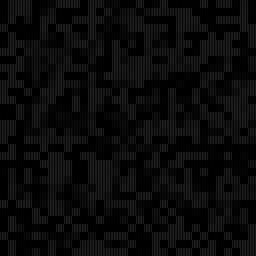
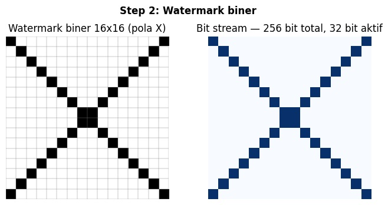
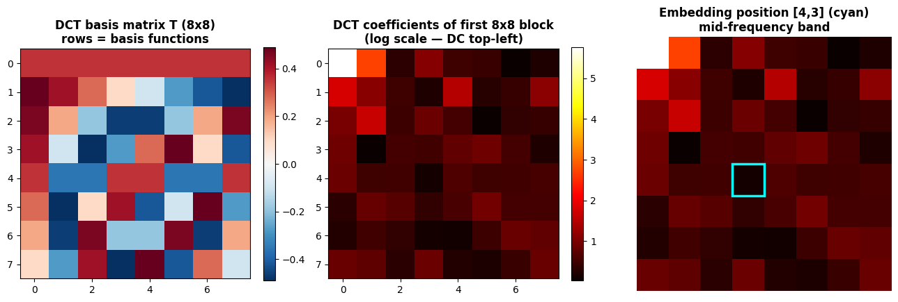
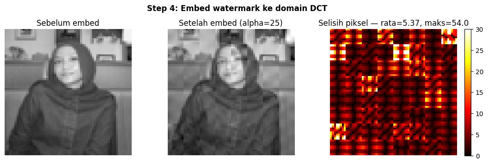
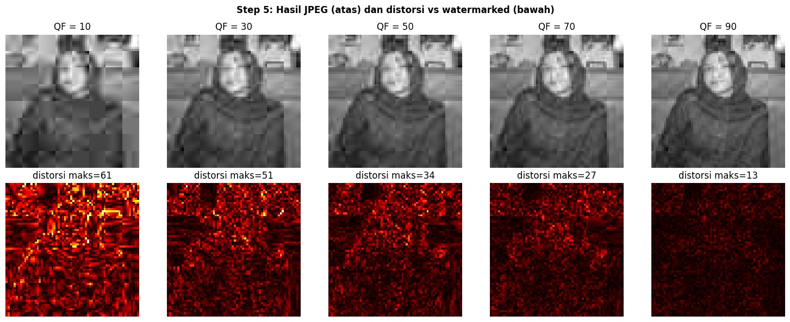
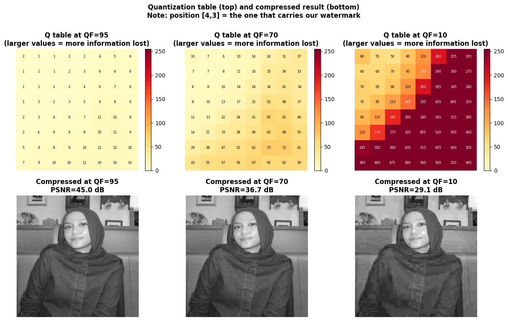
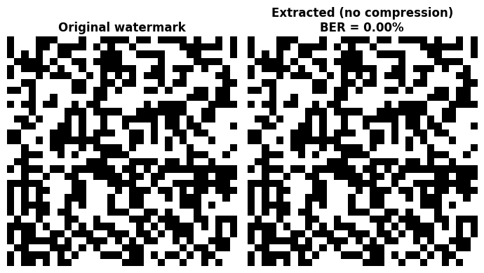
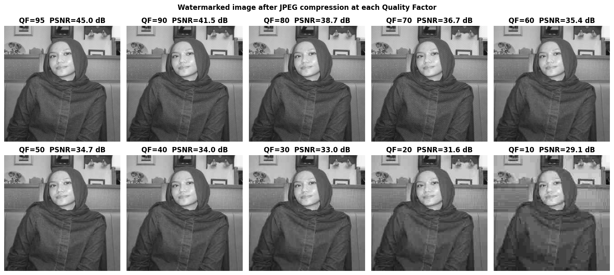
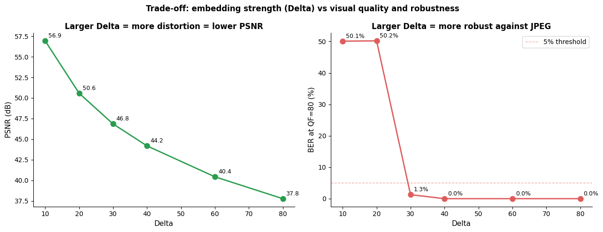

# watermarking-sismul

DCT-based invisible image watermarking. Embed and extract hidden binary watermarks in the frequency domain, robust against JPEG compression.


---

## Demo

| Original | Watermarked | Difference (amplified) |
|:---:|:---:|:---:|
|  |  |  |

The watermark is invisible to the human eye and hidden inside mid-frequency DCT coefficients. Average pixel difference after embedding: **mean = 0.003, max = 24.7**.

---

## What this is

A complete image watermarking pipeline written from scratch in Python. No built-in DCT functions, no JPEG libraries, no watermarking toolkits. Every step DCT, inverse DCT, JPEG quantization, QIM embedding, extraction  is implemented manually using only NumPy, Pillow, and Matplotlib.

The goal is to embed a binary watermark into a face photo, compress the watermarked image at various JPEG quality factors, and measure how much of the watermark survives.

---

## How it works

**1. Preprocessing**

The input photo is converted to grayscale and resized to 256×256. The image is then divided into 8×8 pixel blocks — the same unit JPEG uses internally. A 256×256 image gives 1024 blocks, which is exactly the capacity needed to carry a 32×32 = 1024-bit watermark.

**2. DCT (manual)**

Each 8×8 block is transformed using a manually built DCT-II basis matrix:

```
T[k, i] = sqrt(1/N) * cos(pi * (2i+1) * k / (2N))   for k = 0
         = sqrt(2/N) * cos(pi * (2i+1) * k / (2N))   for k > 0

DCT(block)  = T · block · Tᵀ
IDCT(coefs) = Tᵀ · coefs · T
```

No `scipy.fft.dct`, no `cv2.dct`. The matrix multiply is equivalent to the full double-sum formula.

**3. Watermark**

A 32×32 binary matrix, generated with a fixed random seed (reproducible). Each bit is either 0 or 1. The 1024 bits map one-to-one onto the 1024 blocks in the image.

**4. Embedding with QIM**

QIM (Quantization Index Modulation) encodes each bit by pushing a DCT coefficient onto one of two quantization grids, offset by Δ/2:

```
bit = 0  →  c_embed = round(c / Δ) * Δ
bit = 1  →  c_embed = round((c − Δ/2) / Δ) * Δ + Δ/2
```

Extraction reads the coefficient and checks which grid it is closer to. As long as JPEG compression does not shift the coefficient by more than Δ/4, the correct bit is recovered.

Embedding position: DCT coefficient **[4,3]** (mid-frequency). Mid-frequency is chosen because low-frequency coefficients are perceptually important (distortion becomes visible) and high-frequency coefficients are aggressively zeroed out by JPEG. Mid-frequency survives compression without being obvious.

Step size **Δ = 40** — large enough that JPEG quantization noise at high QF values does not flip a bit, small enough that PSNR stays above 44 dB (imperceptible).

**5. JPEG compression (manual)**

The standard JPEG luminance quantization table (Annex K, QF=50) is scaled to any target QF using the libjpeg formula:

```
S = 5000 / QF          if QF < 50
S = 200 − 2 × QF       if QF ≥ 50

Q_scaled = max(1, round(S × Q50 / 100))
```

Smaller QF → larger divisors → coarser rounding → more information lost per block. Below the threshold QF, the rounding error at position [4,3] exceeds Δ/4 and bits start flipping.

**6. Extraction and evaluation**

Extraction runs the same block loop in reverse: DCT each block, read coefficient [4,3], check which quantization grid it is closest to. No original image required.

Two metrics are reported per QF:

- **BER (Bit Error Rate):** fraction of bits decoded incorrectly. BER = 0 means perfect recovery. BER near 0.5 means the extracted bits are random — watermark is gone.
- **NC (Normalized Correlation):** similarity between original and extracted watermark mapped to {−1, +1}. NC = 1.0 means perfect match. NC near 0 means no correlation.

---

## Results

**Step 1: Load photo and split into 8×8 blocks**


**Step 2: Binary watermark 32×32**



**Step 3: DCT basis matrix and embedding position**

The DCT coefficients of a single 8×8 block, shown in log scale. The cyan box marks position [4,3] where each watermark bit is embedded.



**Step 4: QIM two quantization grids**

Left: the two quantization grids (blue = bit 0, red = bit 1) offset by Δ/2 = 20. Right: decoding decision regions — any coefficient landing in a blue region is decoded as 0, red as 1.



**Step 5: Before and after embedding**

PSNR = 44.18 dB. The watermark is invisible.



**Step 6: JPEG quantization table at different QF**

Top row: the quantization table values (larger = coarser quantization). The value at [4,3] — our embedding position — is what determines whether the watermark survives. Bottom row: the compressed image at each QF.



**Step 7: Compression results at all QF values**



**Step 8: Extracted watermark at each QF**

Green title = recoverable (BER < 5%). Red = failed.



**Step 9: BER, NC, and PSNR vs Quality Factor**

The watermark survives down to QF = 80. At QF = 70, the JPEG quantization step at position [4,3] exceeds Δ/4 = 10, which pushes coefficients across the QIM boundary. BER jumps from 0% to ~50% — complete failure.



**Step 10: Embedding strength trade-off**

Larger Δ = more robust against compression, but lower PSNR (more visible distortion). At Δ = 40, the watermark survives QF = 80 with 0% BER and PSNR stays above 44 dB.


---

## BER summary

| QF | BER | NC | PSNR (dB) | Status |
|----|-----|----|-----------|--------|
| 95 | 0.000 | +1.0000 | 45.37 | PASS |
| 90 | 0.000 | +1.0000 | 41.80 | PASS |
| 80 | 0.000 | +1.0000 | 38.52 | PASS |
| 70 | 0.498 | +0.0039 | 36.37 | FAIL |
| 60 | 0.501 | −0.0020 | 34.94 | FAIL |
| 50 | 0.508 | −0.0156 | 34.19 | FAIL |
| 40 | 0.508 | −0.0156 | 33.43 | FAIL |
| 30 | 0.499 | +0.0020 | 32.46 | FAIL |
| 20 | 0.501 | −0.0020 | 31.06 | FAIL |
| 10 | 0.501 | −0.0020 | 28.69 | FAIL |

**Minimum safe QF: 80**

The hard cutoff is between QF = 80 and QF = 70. At QF = 80, the quantization step at [4,3] is small enough that it does not cross the Δ/4 boundary. At QF = 70 it does, and the BER jumps directly to ~50% — not a gradual degradation, a cliff edge. This is characteristic of QIM: it either works cleanly or fails completely.

---

## Usage

Open `watermarking_final.ipynb` and run cells top to bottom.

**On Google Colab:** upload the notebook via File → Upload notebook. Upload your photo when the upload cell runs. The photo upload dialog appears automatically.

**On VS Code:** put your photo in the same folder as the notebook. Change `IMAGE_PATH` in the first cell:

```python
IMAGE_PATH = 'your_photo.jpg'
```

Embedding and extraction each take 1–2 minutes because DCT is computed manually per block using matrix multiplication, not a fast FFT.

---

## Parameters

| Parameter | Default | Effect |
|-----------|---------|--------|
| `DELTA` | 40.0 | Embedding strength. Larger = more robust, lower PSNR |
| `WM_POS` | (4, 3) | DCT position to embed. Lower index = more robust, more visible |
| `WM_SIZE` | 32 | Watermark dimensions. 32×32 = 1024 bits = fits 256×256 image |
| `IMG_SIZE` | 256 | Input image resize target. Must be multiple of 8 |

---

## Requirements

```
numpy
pillow
matplotlib
```

No DCT libraries. No JPEG codecs beyond PIL for file I/O. No watermarking toolkits.

```bash
pip install numpy pillow matplotlib
```
