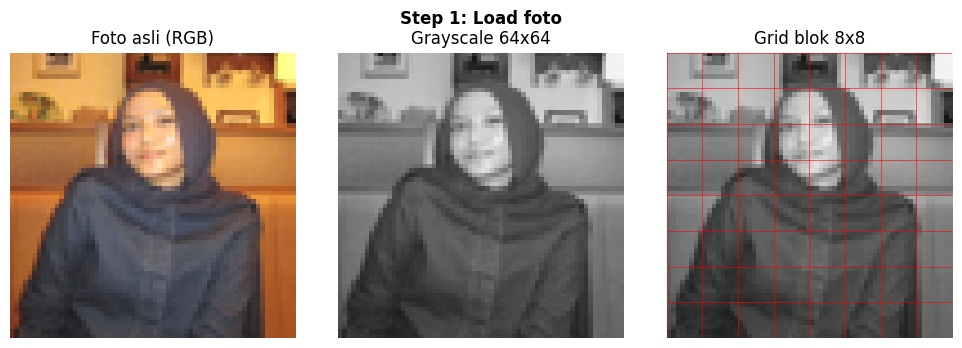
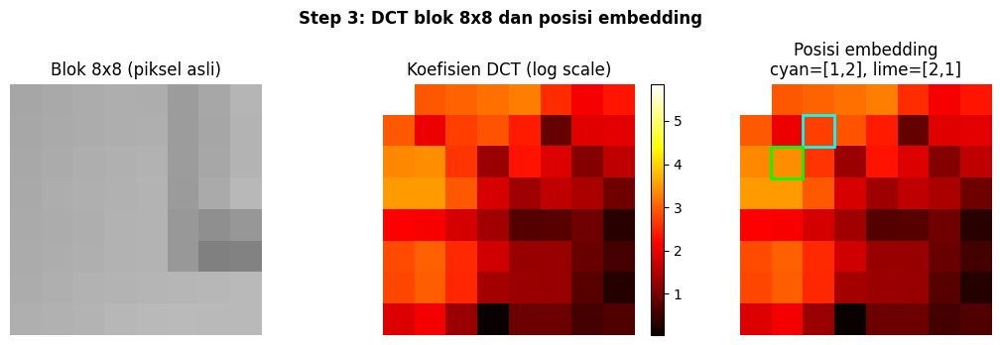
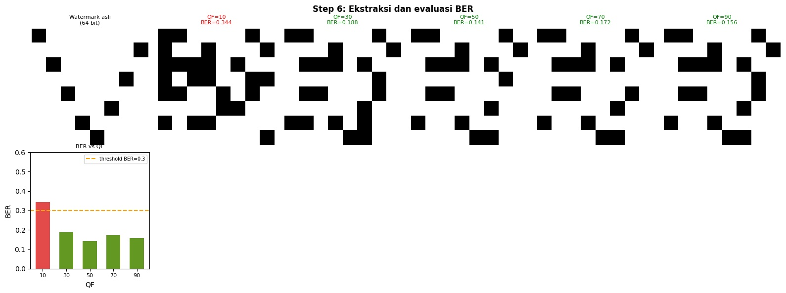

# watermarking-sismul

DCT-based invisible image watermarking. Embed and extract hidden binary watermarks in the frequency domain, robust against JPEG compression.


## Demo

| Original | Watermarked | Difference (10×) |
|:---:|:---:|:---:|
|  |  |  |

The watermark is invisible to the human eye, hidden inside DCT frequency coefficients.

# DCT Domain Watermarking

Embedding a binary watermark into a face image using the DCT domain, then evaluating how well it survives JPEG compression at different quality factors.

## How it works

The image is converted to 64x64 grayscale and split into 8x8 blocks — the same unit JPEG uses internally. A 16x16 binary watermark (X pattern, 256 bits total) is generated, and the first 64 bits are embedded one bit per block at mid-frequency DCT coefficients `[1,2]` and `[2,1]`. Mid-frequency is chosen because it's strong enough to survive compression without visibly distorting the image. After embedding, the image is JPEG-compressed at QF 10, 30, 50, 70, and 90. The watermark is then extracted and evaluated using BER (Bit Error Rate). BER above 0.3 means more than 30% of bits were lost which considered a failure.

## Results

**Step 1 — Load and split into 8x8 blocks**



**Step 2 — Binary watermark (X pattern)**


**Step 3 — DCT coefficients and embedding positions**



**Step 4 — Before and after embedding (alpha=25)**

The watermark is invisible to the eye. Average pixel difference: 5.37.


**Step 5 — JPEG compression at QF 10, 30, 50, 70, 90**

Lower QF = heavier quantization = more watermark bits lost.


**Step 6 — Extraction and BER evaluation**

QF 10 fails (BER = 0.344). QF 30 and above all pass.



## BER summary

| QF | BER | Status |
|----|-----|--------|
| 10 | 0.344 | FAIL |
| 30 | 0.188 | OK |
| 50 | 0.141 | OK |
| 70 | 0.172 | OK |
| 90 | 0.156 | OK |

Minimum safe QF: **30**

## Requirements

```
numpy
matplotlib
Pillow
```

## Usage

Open `watermarking_dct_final.ipynb` and run cells top to bottom. Change `IMAGE_PATH` in the first cell to your own image:

```python
IMAGE_PATH = '/path/to/your/photo.png'
```

Embedding and extraction each take 1-2 minutes because DCT is computed manually per pixel.

